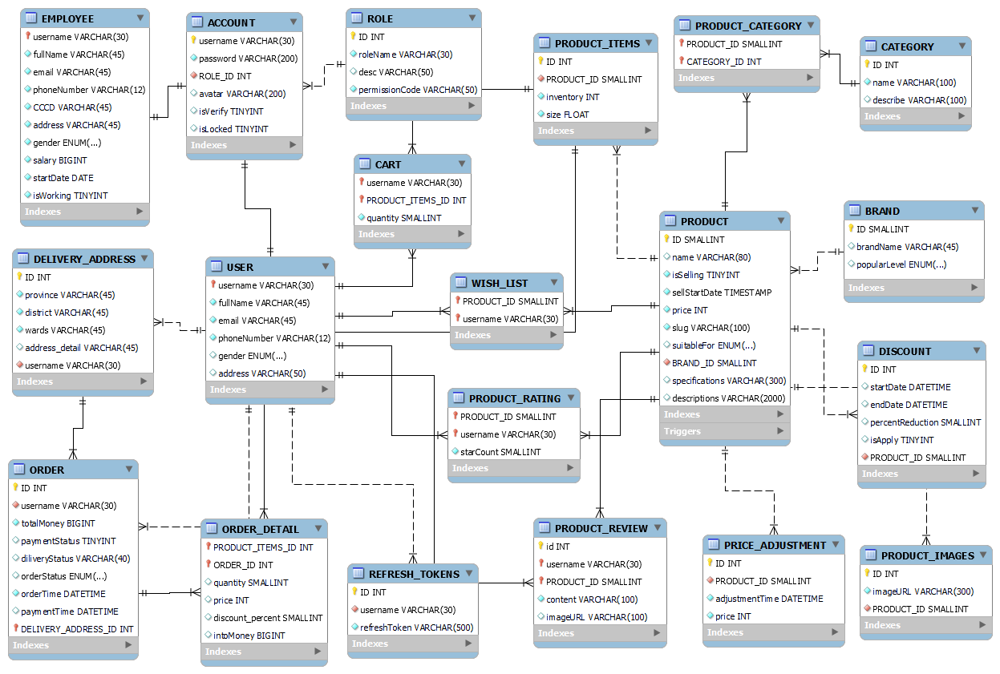

# Shoes Store Webapp

## Tech used:

### - Frontend:

-  Core: HTML, CSS, JS
-  Jquery, Boostrap, Animate.css, wowJS, Glide, just-validate, axios...

### - Backend:

-  Core: Nodejs + Express
-  View engine: EJS
-  Database: SQL(mysql)
-  ORM: sequelize

## Databse Schema:



### GIT COMMIT RULES

```bash
type(scope?): subject
```

### Type List:

-  build: Changes that affect the build system or external dependencies (example scopes: gulp, broccoli, npm)
-  ci: Changes to our CI configuration files and scripts (example scopes: Gitlab CI, Circle, BrowserStack, SauceLabs)
-  chore: add something without touching production code (Eg: update npm dependencies)
-  docs: Documentation only changes
-  feat: A new feature
-  fix: A bug fix
-  perf: A code change that improves performance
-  refactor: A code change that neither fixes a bug nor adds a feature
-  revert: Reverts a previous commit
-  style: Changes that do not affect the meaning of the code (Eg: adding white-space, formatting, missing semi-colons, etc)
-  test: Adding missing tests or correcting existing tests
